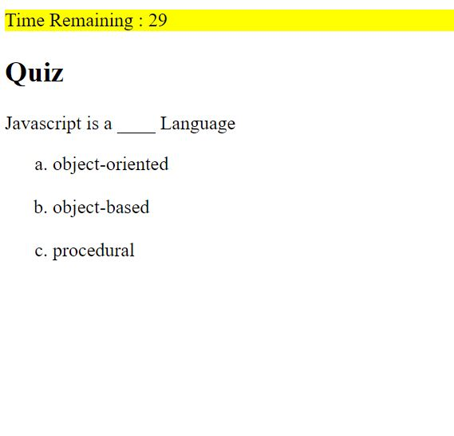
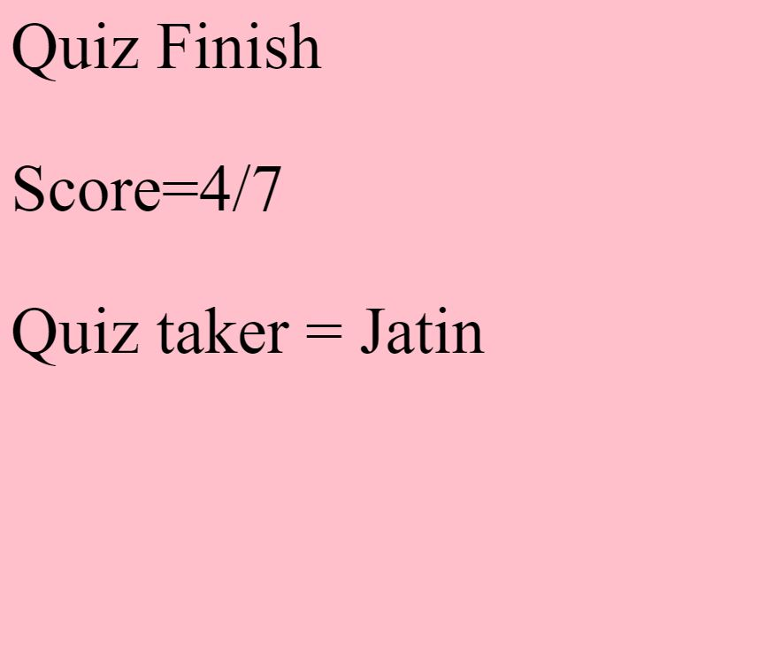

## Module-4-Challenge

# Code Quiz

### I have made a basic javascript quiz. The details are:

* The quiz consists of seven questions.
* There is a maximum time limit of 40 seconds to complete the quiz.
* For each wrong answer, 5 seconds of total time will be deducted.
* Finally, initial will be taken and final score will be displayed.

### Final screen looks like :

